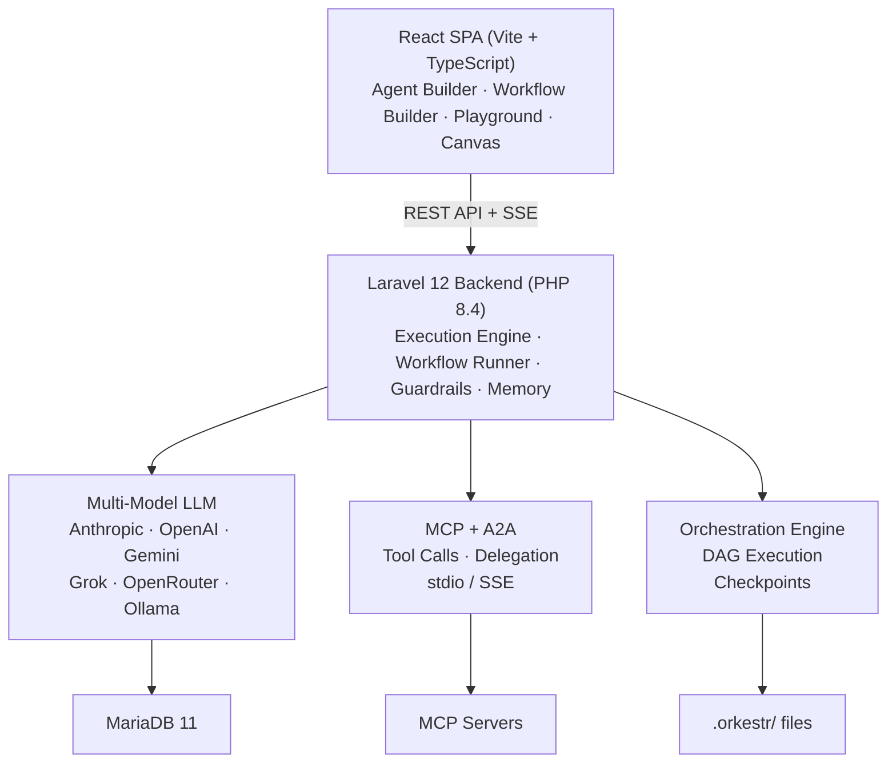

<div align="center">

```
 ██████╗ ██████╗ ██╗  ██╗███████╗███████╗████████╗██████╗
██╔═══██╗██╔══██╗██║ ██╔╝██╔════╝██╔════╝╚══██╔══╝██╔══██╗
██║   ██║██████╔╝█████╔╝ █████╗  ███████╗   ██║   ██████╔╝
██║   ██║██╔══██╗██╔═██╗ ██╔══╝  ╚════██║   ██║   ██╔══██╗
╚██████╔╝██║  ██║██║  ██╗███████╗███████║   ██║   ██║  ██║
 ╚═════╝ ╚═╝  ╚═╝╚═╝  ╚═╝╚══════╝╚══════╝   ╚═╝   ╚═╝  ╚═╝
```

**Self-hosted Agent OS.**
**Design, execute, and manage autonomous AI agents on your own infrastructure.**

[](LICENSE)

</div>

<p align="center">
  
  
  
  
  
  
</p>

---

## What is Orkestr?

Orkestr is a self-hosted platform for building and operating AI agent systems. Design agents with goals, tools, and memory. Wire them into multi-agent workflows. Execute them with real tool calls and full observability. All from a visual UI, on your own infrastructure.

### Three Layers

Orkestr is organized in three layers, each building on the one below:

| Layer | What It Does | Key Capabilities |
|---|---|---|
| **Orchestration** | Coordinates agent teams | Workflows, canvas, parallel execution, checkpoints, schedules |
| **Agents** | Autonomous entities that think and act | Agent loop, MCP tools, A2A delegation, memory, execution traces |
| **Components** | Building blocks | Skills, multi-model access, provider sync, templates, version history |

You can use any layer independently. Start with skills and provider sync, grow into agents and orchestration as your needs evolve.

### Design Principles

- **Agent-first** — Agents are complete loop definitions: Goal → Perceive → Reason → Act → Observe
- **Provider-agnostic** — Mix cloud and local models in the same project. Go fully air-gapped with Ollama.
- **Sovereign by default** — Self-hosted, air-gap capable, no SaaS dependency. You control the security perimeter.
- **Visual orchestration** — DAG workflow builder with conditional branching, parallel execution, and human-in-the-loop checkpoints
- **Real execution** — Not just config. Agents run live with real MCP tool calls, cost tracking, and safety guardrails.

---

## Features

### Orchestration Layer

- **Workflow Builder** — Drag-and-drop DAG editor with React Flow. Step types: agent, checkpoint, condition, parallel split/join.
- **Visual Canvas** — WYSIWYG composition surface for agent teams. Drag agents, skills, MCP servers, and A2A connections.
- **Delegation Chains** — Agent-to-agent handoffs with shared context via A2A protocol
- **Schedules & Triggers** — Cron schedules, webhook triggers, and event-driven execution
- **Export** — LangGraph YAML, CrewAI config, generic JSON

### Agent Layer

- **Agent Builder** — Visual form-based agent configuration: identity, goals, reasoning, tools, autonomy level
- **18 Pre-built Agents** — Semi-autonomous org archetypes with personas and specializations
- **Execution Engine** — Run agent loops with real MCP tool calls, memory persistence, and execution traces
- **Agent Memory** — Conversation, working, and long-term memory that persists across sessions
- **Multi-turn Playground** — Interactive chat with any agent, any model, streaming responses

### Component Layer

- **Skill Editor** — Monaco editor with YAML frontmatter + Markdown, live token counting
- **Version History** — Every save creates a snapshot with diff viewer and one-click restore
- **Skill Composition** — `includes` for recursive prompt composition with circular dependency detection
- **Template Variables** — `{{variable}}` placeholders resolved at compose/sync time
- **Provider Sync** — Write once in `.orkestr/`, sync to 7 AI coding tools (Claude, Cursor, Copilot, Windsurf, Cline, OpenAI)
- **Prompt Linter** — 8 quality rules for prompt analysis
- **AI Generation** — Describe what you want, get a complete skill

### Multi-Model Support

- **7 LLM Providers** — Anthropic, OpenAI, Gemini, Grok (xAI), OpenRouter (200+ models), custom OpenAI-compatible, Ollama
- **Per-agent model assignment** — Route complex tasks to Claude, routine work to local Llama
- **Fallback chains** — Automatic failover with health monitoring and cost-optimized routing
- **Air-gap mode** — Zero external network calls, all local inference

### Safety & Guardrails

- **Budget limits** — Per-run, per-agent, and daily token/cost budgets with enforcement
- **Tool allowlists** — Control which MCP tools each agent can call
- **Output guards** — PII detection, credential redaction, content filtering
- **Approval gates** — Human-in-the-loop for sensitive tool calls (supervised / semi-autonomous / autonomous)
- **Guardrail profiles** — Strict, moderate, permissive presets cascading from org → project → agent

### Platform

- **Multi-tenant** — Organizations with role-based access (owner, admin, editor, viewer)
- **Skill Library** — 25 pre-built skills across Laravel, PHP, TypeScript, FinTech, DevOps, and Technical Writing
- **Bundle export/import** — ZIP/JSON with conflict resolution for sharing skills and agents
- **Webhook system** — Outbound HMAC-signed webhooks + GitHub push receiver
- **Command palette** — Cmd+K fuzzy search across everything
- **Observability** — Full execution traces, replay with timeline scrubber, cost analytics, performance dashboard

---

## Architecture



---

## Quick Start

### With Docker (recommended)

```bash
git clone https://github.com/eooo-io/orkestr.git
cd orkestr

cp .env.example .env
# Edit .env — add your API keys (ANTHROPIC_API_KEY, etc.)

make build
make up
make migrate

# Start the React SPA
cd ui && npm install && npm run dev
```

### Without Docker

```bash
composer install
cp .env.example .env
php artisan key:generate

# Set DB_HOST=127.0.0.1 and DB credentials in .env
php artisan migrate --seed

cd ui && npm install && cd ..
composer dev   # starts server, queue, pail, vite
```

### Access Points

| Interface | URL |
|---|---|
| React SPA | http://localhost:5173 |
| Filament Admin | http://localhost:8000/admin |
| API | http://localhost:8000/api |
| Documentation | http://localhost:5174 |

Default login: `admin@admin.com` / `password`

---

## Tech Stack

| Layer | Technology |
|---|---|
| Runtime | PHP 8.4 |
| Framework | Laravel 12.x |
| Admin UI | Filament 3.x + Livewire 4.x |
| Frontend SPA | React 19 + Vite + TypeScript |
| Styling | Tailwind CSS v4 + shadcn/ui |
| Code Editor | Monaco Editor |
| Canvas | React Flow (@xyflow/react) |
| State Management | Zustand |
| Database | MariaDB 11.x |
| LLM Providers | Anthropic, OpenAI, Gemini, Grok, OpenRouter, Ollama |
| Container | Docker + Docker Compose |
| Testing | Pest PHP + Playwright |

---

## Development Commands

```bash
# Docker
make up          # docker compose up -d
make down        # docker compose down
make build       # docker compose build --no-cache
make migrate     # php artisan migrate --seed
make fresh       # php artisan migrate:fresh --seed
make test        # php artisan test
make shell       # bash into php container
make logs        # docker compose logs -f

# Local dev
composer dev     # runs server, queue, pail, vite concurrently
composer test    # clears config + runs tests

# Type checking
cd ui && npx tsc --noEmit

# Documentation
cd docs && npm run dev    # VitePress dev server
cd docs && npm run build  # Build static site
```

---

## Project Structure

```
orkestr/
├── app/
│   ├── Http/Controllers/   # API controllers (consumed by React SPA)
│   ├── Models/             # Eloquent models
│   ├── Services/           # Business logic
│   │   ├── Execution/      # Agent & workflow execution engine
│   │   ├── LLM/            # Multi-model provider layer (7 providers)
│   │   ├── Guards/         # Budget, tool, approval, output guards
│   │   ├── Mcp/            # MCP protocol client
│   │   └── A2a/            # Agent-to-agent delegation
│   └── Jobs/
├── database/migrations/    # 59 migrations
├── routes/api.php          # REST API
├── ui/                     # React + Vite + TypeScript SPA
│   └── src/
│       ├── pages/          # 30+ pages
│       ├── components/     # Reusable UI components
│       ├── store/          # Zustand store
│       └── api/            # Axios client
├── docs/                   # VitePress documentation site
├── docker-compose.yml
└── Makefile
```

---

## Documentation

Full documentation available at the [Orkestr docs site](https://eooo-io.github.io/orkestr/):

- **[101](https://eooo-io.github.io/orkestr/101/)** — What Orkestr is and how it works
- **[Guide](https://eooo-io.github.io/orkestr/guide/getting-started)** — Setup, configuration, and usage
- **[Deep Dives](https://eooo-io.github.io/orkestr/deep-dive/)** — Architecture internals and design philosophy
- **[Cookbook](https://eooo-io.github.io/orkestr/cookbook/)** — Practical recipes and patterns
- **[Reference](https://eooo-io.github.io/orkestr/reference/skill-format)** — API, formats, and settings

---

## Contributing

Contributions are welcome. Please open an issue first to discuss what you'd like to change.

---

## License

[MIT](LICENSE)
