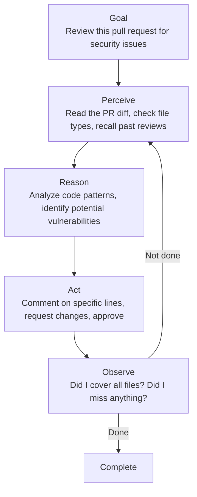
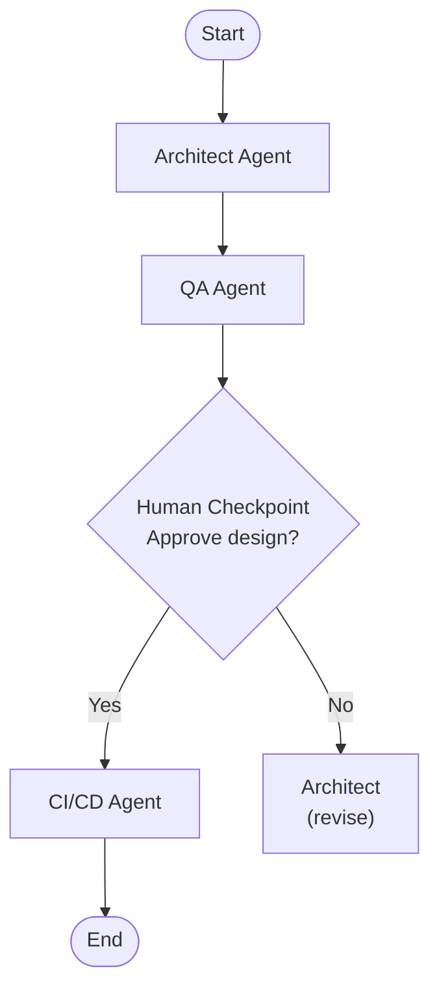
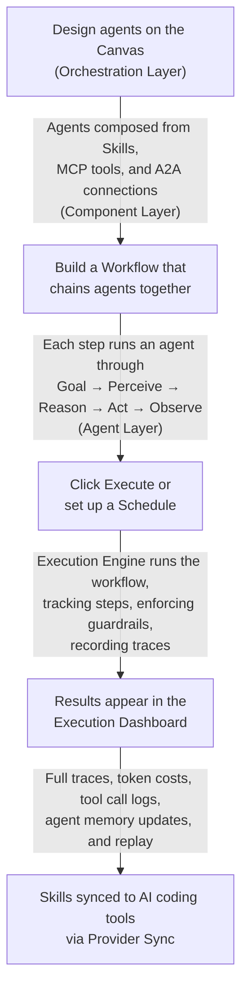

# The Three Layers

## The One-Sentence Answer

Orkestr is built in three layers: **Components** (the building blocks), **Agents** (autonomous entities), and **Orchestration** (multi-agent coordination).

## The Analogy: A Building

Think of a three-story building:

- **Ground floor (Components)** — The raw materials. Bricks, pipes, electrical wiring, doors. Useful on their own, but they become powerful when assembled.
- **Middle floor (Agents)** — Rooms with a purpose. A kitchen has appliances, ingredients, and a recipe — everything needed to cook a meal autonomously.
- **Top floor (Orchestration)** — The building management system. It coordinates which rooms are active, routes people between them, and makes sure the whole building works as a unit.

## Layer 1: Components

Components are the atomic building blocks. They don't do anything on their own — they're the pieces you assemble into agents.

### Skills

A skill is a set of instructions written in Markdown with YAML metadata. Think of it as a "recipe card" for AI behavior:

```markdown
---
name: Code Review Standards
tags: [review, quality]
model: claude-sonnet-4-6
---

When reviewing code, check for:
1. Proper error handling
2. Test coverage
3. Security vulnerabilities
```

Skills can include other skills, use template variables, and be reused across projects and agents.

### Tools (MCP Servers)

MCP (Model Context Protocol) servers give agents the ability to interact with the real world:

- Read and write files
- Query databases
- Call APIs
- Run shell commands
- Access knowledge bases

An agent without tools is just a text generator. An agent *with* tools can actually do things.

### Connections (A2A)

A2A (Agent-to-Agent) protocol lets agents communicate. Agent A can send a task to Agent B and receive the result. This is how delegation works.

### Provider Sync

The ability to take skills and deliver them to AI coding tools (Claude, Cursor, Copilot, etc.) in each tool's native format. This is the bridge between Orkestr and your everyday development workflow.

## Layer 2: Agents

An agent is a **complete autonomous entity**. It's not just a prompt — it's a loop:



Each agent in Orkestr has a full definition:

| Section | What It Defines | Example |
|---|---|---|
| **Identity** | Name, role, icon, persona | "Security Auditor — methodical, thorough" |
| **Goal** | Objective, success criteria, max iterations | "Find all OWASP Top 10 vulnerabilities" |
| **Perception** | Input schema, memory sources, context strategy | "Read PR diff + project security history" |
| **Reasoning** | Model, skills, temperature, planning mode | "Use Claude Opus, apply security-checklist skill" |
| **Actions** | MCP tools, A2A delegation, custom tools | "Can read files, query SAST database, delegate to QA" |
| **Observation** | Eval criteria, output schema, loop condition | "Stop when all files reviewed and findings documented" |
| **Orchestration** | Parent agent, delegation rules, autonomy level | "Reports to Orchestrator, can delegate to Code Review Agent" |

Orkestr ships with 9 pre-built agents (Orchestrator, PM, Architect, QA, Design, Code Review, Infrastructure, CI/CD, Security) that you can customize or use as starting points.

## Layer 3: Orchestration

Orchestration coordinates multiple agents working together. It uses **workflows** — directed acyclic graphs (DAGs) where each node is an agent or decision point.



Workflow features:

- **Agent steps** — Run a specific agent
- **Condition steps** — Route based on previous results
- **Parallel splits** — Run multiple agents simultaneously
- **Parallel joins** — Wait for all parallel branches to complete
- **Checkpoints** — Pause for human review and approval
- **Shared context** — A context bus that passes data between steps

## How the Layers Interact



## Why Three Layers?

The layering means you can use Orkestr at whatever level suits your needs:

- **Just want skills and provider sync?** Use the Component Layer only. Create skills, sync to Claude/Cursor/Copilot. Done.
- **Want autonomous agents?** Define agents with goals, tools, and memory. Run them in the built-in execution engine.
- **Want coordinated agent teams?** Build workflows that chain agents together with conditions, checkpoints, and shared context.

Each layer builds on the one below. You can start simple and grow into complexity as your needs evolve.

---

**Next:** [What are Skills?](./what-are-skills) →
