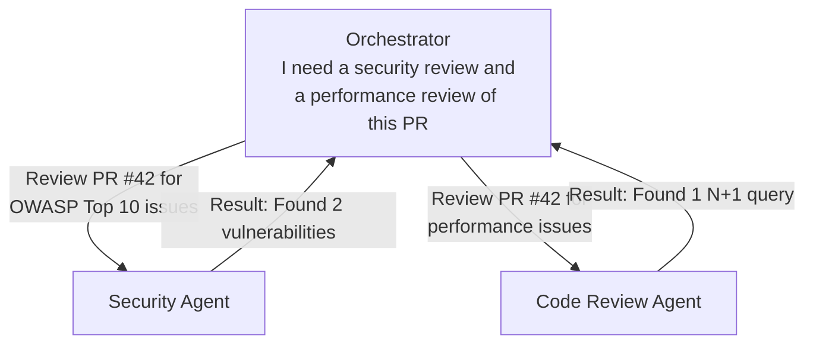
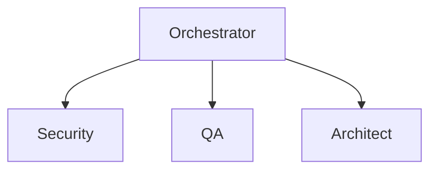
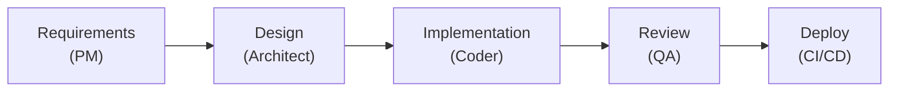
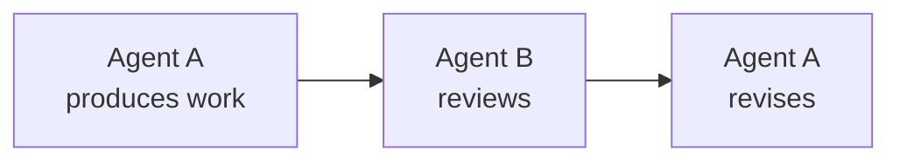

# What is A2A?

## The One-Sentence Answer

A2A (Agent-to-Agent) is a protocol that lets agents delegate tasks to other agents and receive results back.

## The Analogy: Coworkers Passing Tasks

In an office, people don't do everything themselves. A project manager writes the requirements, then hands them to the architect. The architect designs the system, then passes specific components to the engineers. Each person is an expert in their domain.

A2A works the same way for agents:



The Orchestrator didn't do the reviews itself — it delegated to specialists and collected the results.

## Why Not Just One Big Agent?

You *could* put all skills and tools into a single mega-agent. But there are good reasons not to:

| Approach | Pro | Con |
|---|---|---|
| One big agent | Simple setup | Confused by too many instructions, huge context window, expensive |
| Specialized agents | Focused, cheaper, better results | Need coordination |

Specialized agents are like specialist doctors. A cardiologist is better at heart problems than a general practitioner. By keeping agents focused, each one does its job better — with a smaller context window and lower cost per run.

A2A provides the coordination layer that makes specialization work.

## How A2A Works

The A2A protocol defines a standard way for agents to communicate:

### 1. Agent Card Discovery

Every A2A-compatible agent publishes an "agent card" — a description of what it can do:

```json
{
  "name": "Security Auditor",
  "description": "Reviews code for OWASP Top 10 vulnerabilities",
  "capabilities": ["security-review", "vulnerability-scan"],
  "input_schema": { "pr_number": "integer", "repo": "string" },
  "output_schema": { "findings": "array", "severity": "string" }
}
```

### 2. Task Delegation

An agent sends a task to another agent:

```
From: Orchestrator
To: Security Auditor
Task: "Review PR #42 in the main repo for security vulnerabilities"
```

### 3. Result Return

The receiving agent runs its full agent loop (Goal → Perceive → Reason → Act → Observe) and returns the result:

```
From: Security Auditor
To: Orchestrator
Result: {
  findings: [
    { severity: "high", issue: "SQL injection in auth.ts:15" },
    { severity: "medium", issue: "XSS in api.ts:42" }
  ]
}
```

## A2A in Orkestr

### Registering A2A Agents

In Orkestr, you can register both:

- **Internal agents** — Other agents defined in the same Orkestr instance
- **External agents** — Agents running on other platforms that expose an A2A endpoint

### Binding A2A to Agents

Just like MCP tools, you bind A2A agents to your agents. On the Canvas, draw a connection from one agent to another. The connecting agent can now delegate tasks.

### Delegation Chains

Agents can delegate to agents who delegate to other agents:

```
Orchestrator
    ├──► Architect Agent
    │        └──► Infrastructure Agent (sub-delegation)
    ├──► QA Agent
    │        └──► Security Agent (sub-delegation)
    └──► PM Agent
```

Orkestr tracks the entire delegation chain in the execution trace, so you can see exactly who delegated what to whom.

### Budget Cascading

When an agent delegates, the child agent inherits a subset of the parent's remaining budget:

```
Orchestrator: $5.00 budget
    ├──► Security Agent: $2.00 (allocated by orchestrator)
    │        └──► Remaining: $1.85 after its own work
    └──► Code Review: $2.00 (allocated by orchestrator)
         └──► Remaining: $1.50 after its own work

Orchestrator remaining: $1.00 (kept for final synthesis)
```

Child agents can never exceed their allocated budget, and they can never exceed the remaining budget of their parent. This prevents runaway costs in delegation chains.

## A2A vs. MCP

Both A2A and MCP let agents interact with external systems, but they serve different purposes:

| | MCP | A2A |
|---|---|---|
| **What it connects to** | Tools (file system, database, APIs) | Other agents |
| **Communication style** | Function call → result | Task → autonomous execution → result |
| **Execution** | The tool runs a specific function | The receiving agent runs its full loop |
| **Complexity** | Simple input/output | Complex reasoning and multi-step work |
| **Example** | "Read this file" | "Review this PR and file issues" |

MCP is for simple, deterministic tool calls. A2A is for complex, autonomous task delegation.

## Real-World A2A Patterns

### The Hub-and-Spoke Pattern

One orchestrator delegates to specialists:



### The Pipeline Pattern

Each agent passes its output to the next:



### The Peer Review Pattern

Agents review each other's work:



## Key Takeaway

A2A is how agents become teams. It lets specialized agents delegate to each other, with full observability, budget enforcement, and chain tracking. Combined with MCP (for tool access) and skills (for knowledge), A2A completes the picture of what agents can do.

---

**Next:** [What are Workflows?](./what-are-workflows) →
