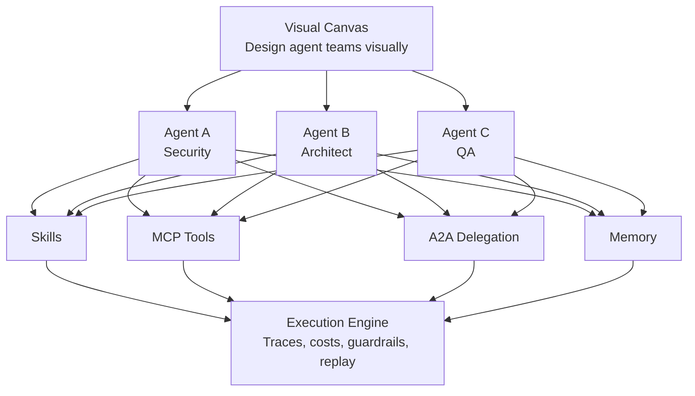

# What is Orkestr?

## The One-Sentence Answer

Orkestr is a **provider-agnostic, deployment-flexible agent runtime** for composing, orchestrating, and operating multi-agent systems across cloud, hybrid, and fully air-gapped environments.

## The Positioning

Most agent platforms assume: their cloud, their models, their data handling, their uptime, their prices.

Orkestr assumes the opposite. You choose the models. You choose the infrastructure. You control the data. You own the deployment. The runtime doesn't dictate the intelligence topology — you do.

This makes Orkestr an **operating substrate for sovereign agent systems**:

- **Sovereign models** — Any model from any provider, including your own hardware
- **Sovereign infrastructure** — Self-hosted, your servers, your security perimeter
- **Sovereign topology** — Agent teams and workflows shaped by your organization, not a platform's opinions
- **Sovereign data** — Nothing leaves your infrastructure unless you configure it to
- **Sovereign deployment** — Cloud, hybrid, or air-gapped without changing your agent definitions

## The Analogy: An Operating System

Your phone has iOS or Android. Your laptop has macOS or Windows. These operating systems don't *do* your work — they provide the environment where apps run. They handle scheduling, security, memory management, networking, and give you a visual interface to manage everything.

Orkestr does the same thing, but for AI agents:

| Operating System Concept | Orkestr Equivalent |
|---|---|
| Apps | Agents |
| App Store | Skill Library |
| File System | Skills, stored in `.agentis/` |
| Networking | MCP (tool connections) and A2A (agent-to-agent) |
| Task Scheduler | Agent Schedules & Triggers |
| Security & Permissions | Guardrails, Budgets, Approval Gates |
| Process Monitor | Execution Dashboard, Trace Viewer |
| Memory Management | Agent Memory (conversation + working memory) |
| Device Drivers | LLM Provider Drivers (Anthropic, OpenAI, Gemini, Ollama, etc.) |
| Control Panel | Canvas + Settings |

## What Does It Actually Do?

### 1. Design Agents

You create AI agents with full autonomous loop definitions. Each agent has:

- **Identity** — A name, role, and persona (e.g., "Security Auditor")
- **Goal** — What it's trying to accomplish, with success criteria
- **Perception** — What inputs and context it receives
- **Reasoning** — Which AI model powers its thinking, what skills guide it
- **Actions** — Which tools (MCP servers) it can use, which other agents (A2A) it can delegate to
- **Observation** — How it evaluates its own output and decides whether to loop again

This isn't just "a system prompt." It's a complete definition of an autonomous entity.

### 2. Compose Agent Teams

Agents rarely work alone. In Orkestr, you can:

- **Wire agents together** on a visual canvas — drag, drop, connect
- **Build workflows** — multi-step pipelines where one agent's output feeds the next
- **Set up delegation** — an orchestrator agent that assigns tasks to specialist agents
- **Add checkpoints** — pause points where a human reviews before the workflow continues

### 3. Execute Agents

Orkestr has a built-in runtime. You don't need an external framework — agents execute inside the platform:

- They make real tool calls via MCP (reading files, querying databases, calling APIs)
- They delegate tasks to other agents via A2A protocol
- They maintain memory across sessions
- Every step is traced: inputs, outputs, tool calls, token costs, latency

### 4. Manage Everything

- **Guardrails** — Organization-level safety policies that cascade from org → project → agent
- **Budgets** — Per-agent, per-run, and daily token/cost limits
- **Schedules** — Run agents on cron schedules or trigger them via webhooks
- **Observability** — Full execution traces, cost analytics, and replay
- **Air-Gap Mode** — Run 100% offline with local models, zero external network calls

## What Does "Self-Hosted" Mean?

Self-hosted means Orkestr runs on **your** computer or server. Your instructions, your agent definitions, your API keys, your execution traces — everything stays on your infrastructure. Nobody else has access.

::: info Why Self-Hosted?
Agent systems handle sensitive data — they read your code, your documents, your databases. They make decisions that affect your infrastructure. Self-hosting means **you** control the security perimeter, not a SaaS vendor. You can even run fully air-gapped with local models.
:::

## The Platform at a Glance

## Who Is It For?

- **Development teams** who want AI agents that follow their specific conventions, use their specific tools, and operate within their security boundaries
- **Organizations** who need enterprise controls — SSO, audit logs, guardrails, approval workflows — around their AI agents
- **Privacy-conscious teams** who need everything on-premises, potentially air-gapped with local models
- **Platform engineers** who want to provide managed AI agent infrastructure to their teams
- **AI builders** who want to design, test, and iterate on agent systems without writing framework code

## What Orkestr Is NOT

- **Not an AI model.** Orkestr doesn't contain a language model. It *connects to* models — Claude, GPT, Gemini, Grok, Ollama, vLLM, or 200+ via OpenRouter.
- **Not a chatbot.** Agents are autonomous entities with goals and tools, not chat windows.
- **Not a cloud service.** You run it. You own it. You control it.
- **Not another agent framework.** Frameworks give you building blocks and wish you luck. Orkestr is a complete runtime — execution, orchestration, observability, governance — that operates agents in production.
- **Not demo-ware.** The workflow engine runs DAGs with parallel execution, conditional routing, human checkpoints, and budget constraints. Not "invoke agent A, then agent B, hope for the best."

---

**Next:** [The Three Layers](./the-three-layers) →
