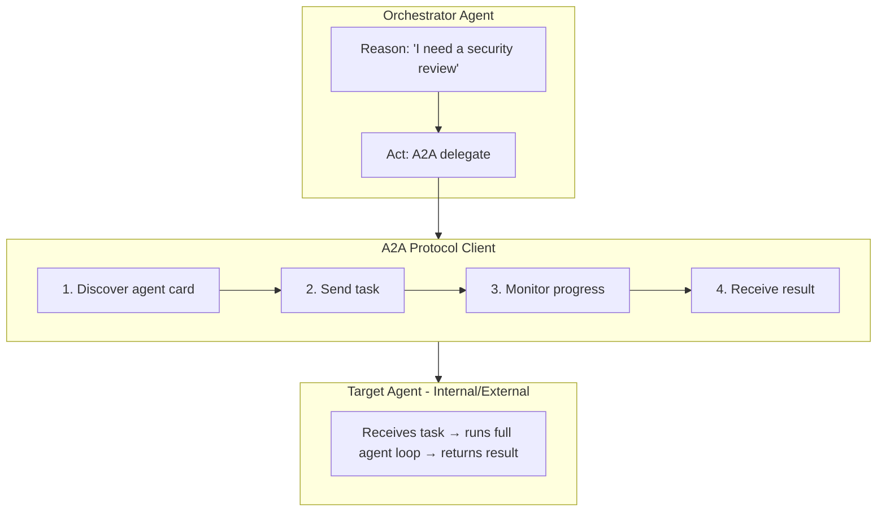

# A2A Protocol

This deep dive covers the Agent-to-Agent protocol implementation in Orkestr — how agents delegate tasks to other agents, discover capabilities, and manage delegation chains.

## Architecture Overview



## Agent Cards

Every A2A-compatible agent publishes an **agent card** — a JSON document describing its capabilities:

```json
{
  "name": "Security Auditor",
  "description": "Reviews code for OWASP Top 10 vulnerabilities",
  "version": "1.0",
  "capabilities": [
    {
      "name": "security-review",
      "description": "Review code changes for security vulnerabilities",
      "input_schema": {
        "type": "object",
        "properties": {
          "diff": { "type": "string", "description": "The code diff to review" },
          "file_list": { "type": "array", "items": { "type": "string" } }
        },
        "required": ["diff"]
      },
      "output_schema": {
        "type": "object",
        "properties": {
          "findings": { "type": "array" },
          "summary": { "type": "string" }
        }
      }
    }
  ]
}
```

Agent cards serve the same purpose as MCP tool schemas — they let the calling agent (and its LLM) understand what the target agent can do, what inputs it expects, and what outputs it provides.

## Task Delegation Flow

### 1. The LLM Decides to Delegate

During the Reason stage, the LLM sees A2A agents as available "tools" alongside MCP tools. When it decides to delegate:

```json
{
  "type": "tool_use",
  "name": "a2a_delegate",
  "input": {
    "target_agent": "security-auditor",
    "task": "Review these code changes for OWASP Top 10 vulnerabilities",
    "context": { "diff": "...", "file_list": ["auth.ts", "api.ts"] }
  }
}
```

### 2. Budget Allocation

Before the task is sent, the BudgetGuard allocates a portion of the parent's remaining budget:

```
Parent budget remaining: $4.50
Delegation allocation: $2.00 (configurable per agent)
Parent retains: $2.50 for remaining work
```

The child agent can't exceed its allocated budget. If the parent's remaining budget is less than the minimum allocation, delegation is blocked.

### 3. Task Execution

**For internal agents** (same Orkestr instance):
- A new execution run is created for the child agent
- The child runs its full agent loop with the delegated task as input
- The parent execution is paused, waiting for the child to complete

**For external agents** (remote A2A endpoints):
- An HTTP request is sent to the external agent's A2A endpoint
- The response is polled or streamed back
- Results are parsed according to the agent card's output schema

### 4. Result Return

The child agent's output is returned to the parent agent as a tool result:

```json
{
  "type": "tool_result",
  "content": {
    "findings": [
      { "severity": "high", "file": "auth.ts", "line": 15, "issue": "SQL injection" }
    ],
    "summary": "1 high-severity finding",
    "tokens_used": 2400,
    "cost": "$0.008"
  }
}
```

The parent agent can then reason about this result and decide what to do next.

## Delegation Chains

Agents can delegate to agents who delegate to other agents, forming chains:

```
Orchestrator ($10 budget)
├── Architect Agent ($3 budget)
│   └── Infrastructure Agent ($1 budget)
│       └── (cannot delegate further — budget too low)
├── Security Agent ($3 budget)
│   └── Code Review Agent ($1 budget)
└── QA Agent ($3 budget)
    └── (chose not to delegate)
```

### Chain Tracking

Orkestr tracks the full delegation chain in the execution trace:

```
execution_runs
├── Run #1 (Orchestrator) parent: null
│   ├── Run #2 (Architect) parent: Run #1
│   │   └── Run #3 (Infrastructure) parent: Run #2
│   ├── Run #4 (Security) parent: Run #1
│   │   └── Run #5 (Code Review) parent: Run #4
│   └── Run #6 (QA) parent: Run #1
```

### Scope Intersection

Child agents inherit the **intersection** of their own permissions and their parent's permissions:

```
Parent (Orchestrator):
  Allowed tools: filesystem, github, database
  Allowed paths: /src, /tests, /docs

Child (Security Agent):
  Own permissions: filesystem, github, shell
  Inherited: filesystem, github (intersection)
  Blocked: shell (parent doesn't allow), database (child doesn't have)
  Allowed paths: /src, /tests (inherited), not /docs (not in child's own config)
```

This prevents privilege escalation through delegation.

## Data Model

```
a2a_agents
├── id (UUID)
├── project_id → projects
├── name: "External Security Service"
├── url: "https://security-agent.internal/a2a"
├── agent_card (JSON) — cached agent card
├── protocol_version: "1.0"
├── status: "active" | "inactive" | "pending_approval"
└── auth_config (JSON) — API key, bearer token, etc.

agent_a2a_agent (pivot)
├── agent_id → agents
├── a2a_agent_id → a2a_agents
└── project_id → projects
```

## Endpoint Approval

Like MCP servers, external A2A endpoints go through approval:

1. Admin registers the external agent URL
2. Orkestr fetches the agent card (capability discovery)
3. Admin reviews the capabilities
4. Admin approves or rejects
5. If approved, the agent becomes available for delegation

Internal agents (within the same Orkestr instance) don't need approval.

## Security Considerations

| Risk | Mitigation |
|---|---|
| Child agent exceeds budget | BudgetGuard enforces allocated limit |
| Child accesses unauthorized data | Scope intersection limits permissions |
| Delegation chain too deep | Configurable max depth (default: 5) |
| Infinite delegation loop | Chain tracking detects cycles |
| External agent returns malicious content | OutputGuard scans all returned content |
| External endpoint is compromised | Endpoint approval + re-validation on capability change |

## Performance

| Operation | Typical Latency |
|---|---|
| Agent card discovery | 50-200ms (cached after first fetch) |
| Internal delegation | ~100ms overhead + child execution time |
| External delegation | 200-500ms overhead + child execution time |
| Budget calculation | <5ms |
| Scope intersection | <5ms |
