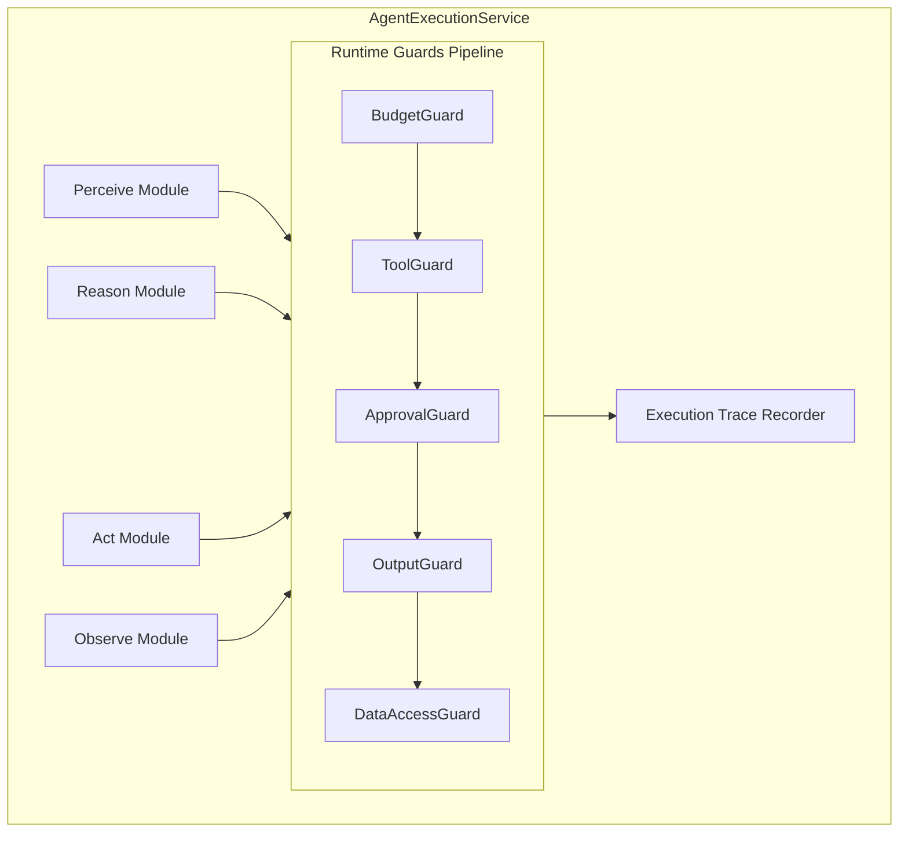
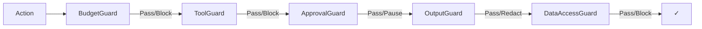

# Agent Loop Architecture

This deep dive covers the technical implementation of Orkestr's agent execution engine — the system that runs the Goal → Perceive → Reason → Act → Observe loop.

## System Overview



## The AgentExecutionService

The core service that drives agent execution. Located at `app/Services/AgentExecutionService.php`.

### Initialization

When an agent execution begins:

1. **Load agent definition** — Identity, goal, perception, reasoning, actions, observation config
2. **Resolve skills** — Expand includes recursively (max depth 5), resolve template variables
3. **Build system prompt** — Compose the agent's skills, persona, and instructions into a single system prompt
4. **Connect MCP servers** — Start stdio processes or open SSE connections via `McpClientService`
5. **Initialize memory** — Retrieve relevant conversation and working memory via `AgentMemoryService`
6. **Create execution run** — Record in `execution_runs` table with status `running`
7. **Allocate budget** — Set token and cost limits from agent config and guardrail policies

### The Loop

```php
while (!$terminated) {
    // 1. Perceive — build context
    $context = $this->perceive($agent, $input, $memory, $previousResults);

    // 2. Reason — call the LLM
    $response = $this->reason($agent, $context);

    // 3. Act — execute tool calls or produce output
    $results = $this->act($agent, $response);

    // 4. Observe — evaluate and decide whether to continue
    $terminated = $this->observe($agent, $results, $iteration);

    // 5. Record — trace this iteration
    $this->recordStep($run, $iteration, $context, $response, $results);

    $iteration++;
}
```

### Perceive Stage

Builds the context for the current iteration:

```
Context Assembly:
├── System prompt (composed skills + persona)
├── Goal definition
├── Direct input (user query, PR diff, etc.)
├── Memory injection (relevant memories, scored by relevance)
├── Previous iteration results (tool outputs, observations)
├── Available tools (discovered from MCP servers)
└── Delegation targets (A2A agents)
```

### Reason Stage

Calls the LLM via `LLMProviderFactory`:

```
Request:
├── Provider: resolved from model name (claude- → Anthropic, gpt- → OpenAI, etc.)
├── Model: agent's configured model (with fallback chain)
├── System prompt: composed context from Perceive
├── Messages: conversation history for this run
├── Tools: MCP tool schemas + A2A delegation schemas
├── Temperature: from agent config
└── Max tokens: from agent config

Response:
├── Text content (reasoning, analysis)
├── Tool use requests (function calls to execute)
└── Token usage (input/output counts for cost tracking)
```

### Act Stage

Processes the LLM's response:

**If the response contains tool calls:**

```
For each tool call:
  1. Guard check → ToolGuard validates tool is allowed
  2. Guard check → BudgetGuard validates cost is within limits
  3. Guard check → ApprovalGuard checks if human approval needed
  4. If approved:
     a. Route to handler:
        - MCP tool → McpClientService.invokeTool()
        - A2A delegation → A2A client sends task
        - Custom tool → inline handler
     b. Record tool call in execution trace
     c. Return result to the loop
```

**If the response is text output:**

```
  1. Guard check → OutputGuard scans for PII, secrets
  2. If clean: return as iteration result
  3. If violations: redact and record violation
```

### Observe Stage

Evaluates whether the agent should continue:

```
Termination conditions (checked in order):
  1. Goal met — agent's output matches success criteria
  2. Max iterations — hard limit reached
  3. Timeout — wall-clock time exceeded
  4. Budget exhausted — token/cost limit reached
  5. Error — unrecoverable failure
  6. Agent decision — agent explicitly signals completion
```

## Execution Runs and Steps

### Data Model

```
execution_runs
├── id (UUID)
├── project_id → projects
├── agent_id → agents
├── workflow_step_id → workflow_steps (nullable, for workflow execution)
├── status: pending | running | completed | failed | paused | cancelled
├── input (JSON)
├── output (JSON)
├── total_tokens, prompt_tokens, completion_tokens
├── total_cost
├── iterations
├── started_at, completed_at
└── error_message

execution_steps
├── id (UUID)
├── execution_run_id → execution_runs
├── iteration (integer)
├── type: perceive | reason | act | observe
├── input (JSON) — what went into this step
├── output (JSON) — what came out
├── tokens_used, cost
├── tool_name, tool_input, tool_output (for act steps)
├── duration_ms
└── guard_results (JSON) — which guards checked and their results
```

### Trace Recording

Every step of every iteration is recorded in `execution_steps`. This provides:

- **Full replay** — Step through any execution after the fact
- **Debugging** — See exactly what the agent "thought" at each point
- **Cost attribution** — Token and cost per step, per iteration, per run
- **Guard audit** — Which guards checked and whether they passed or triggered

## Guards Pipeline

Guards run as a pipeline — each guard checks the current action and either passes, blocks, or pauses:



### BudgetGuard

Checks three levels:
1. **Per-run budget** — Has this run exceeded its allocation?
2. **Per-agent daily budget** — Has this agent exceeded its daily limit?
3. **Organization daily budget** — Has the org exceeded its total limit?

Also enforces delegation cascading — child agents can't exceed their parent's remaining budget.

### ToolGuard

Checks against organization, project, and agent-level policies:
1. **Allowlist check** — Is this tool explicitly allowed?
2. **Blocklist check** — Is this tool explicitly blocked?
3. **Dangerous input scan** — Does the input contain suspicious patterns (command injection, path traversal)?

### ApprovalGuard

Based on the agent's autonomy level:
- **Autonomous** → All actions pass
- **Supervised** → Expensive (>threshold) and destructive actions pause for human approval
- **Manual** → Every action pauses for human approval

When paused, the execution run status changes to `paused`, and a notification is sent. Execution resumes when a human approves or rejects.

### OutputGuard

Scans LLM output and tool results for sensitive content:
- PII (emails, phone numbers, SSNs)
- Secrets (API keys, passwords, tokens)
- Configurable per-organization patterns

Detected content is redacted before being stored or returned.

### DataAccessGuard

Enforces data boundaries:
- File access limited to project directory
- API calls limited to approved endpoints
- Database queries limited to allowed schemas

## MCP Tool Lifecycle

The execution engine manages MCP server connections:

```
Execution Start:
  └── For each bound MCP server:
      ├── stdio: spawn child process, establish stdin/stdout pipes
      └── SSE: open HTTP connection to server

During Execution:
  ├── Tool calls routed to the appropriate MCP server
  ├── Responses parsed and returned to the agent loop
  └── Connection health monitored (reconnect on failure)

Execution End:
  ├── stdio: terminate child processes
  └── SSE: close connections
```

## Memory Integration

`AgentMemoryService` provides memory operations:

```
Before each iteration (Perceive):
  └── Recall relevant memories
      ├── Query by: current task, agent ID, project ID
      ├── Rank by: relevance score, recency
      └── Limit: max memory tokens from config

After iteration (if notable):
  └── Store new memories
      ├── Conversation memory: input/output pairs
      ├── Working memory: key facts learned
      └── Scope: run, agent, project, or org
```

## Workflow Execution

For workflow-level execution, the `WorkflowExecutionRunner` drives the DAG:

```
1. Start at entry step
2. For each step:
   a. If agent step → create an execution run, run the agent loop
   b. If condition → evaluate expression against context
   c. If checkpoint → pause for human approval
   d. If parallel_split → fork into parallel branches
   e. If parallel_join → wait for all branches to complete
3. Pass results to shared context bus
4. Follow edges to next step(s)
5. Repeat until end node reached
```

The `WorkflowContextService` manages the shared context bus — a key-value store that steps read from and write to. The `WorkflowConditionEvaluator` evaluates edge condition expressions to determine routing.

## Cost Tracking

Cost is tracked at every level:

```
Token Usage:
├── Per-step: each LLM call records input/output tokens
├── Per-iteration: sum of all steps in one loop cycle
├── Per-run: sum of all iterations
├── Per-agent-day: rolling 24-hour aggregate
└── Per-org-day: rolling 24-hour aggregate

Cost Calculation:
├── Provider-specific pricing applied per model
├── Tool call costs (for paid APIs) tracked separately
└── Delegation costs attributed to the parent agent
```

## Error Handling

The execution engine handles failures at every level:

| Failure | Behavior |
|---|---|
| LLM API error | Try fallback model chain; if all fail, mark run as `failed` |
| MCP connection lost | Attempt reconnect; if fail, mark tool as unavailable |
| Tool call error | Record error in trace, agent can reason about the failure |
| Budget exceeded | Graceful stop, return partial results |
| Timeout | Graceful stop, return partial results |
| Unhandled exception | Mark run as `failed`, record stack trace |

## Performance Characteristics

| Metric | Typical Range |
|---|---|
| Loop iteration latency | 1-5 seconds (dominated by LLM response time) |
| MCP tool call overhead | 10-100ms (local), 100-500ms (remote) |
| Memory recall | <50ms |
| Guard pipeline | <10ms total |
| Trace recording | <5ms per step (async) |
