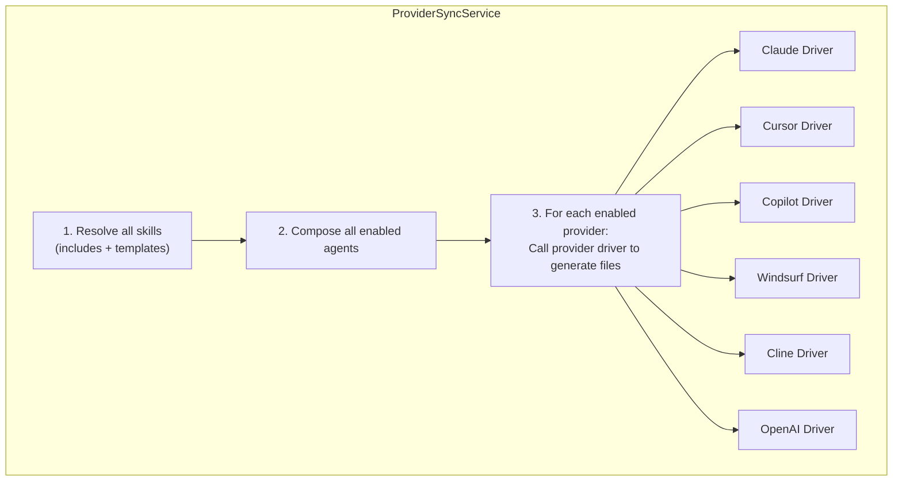

# Provider Sync Engine

This deep dive covers the provider sync system — how skills and composed agents are translated into the native config format of each AI coding tool.

## Architecture



## Sync Pipeline

### Step 1: Resolve Skills

For each skill in the project:

```
SkillCompositionService.resolve(skill):
  1. Parse includes: [slug1, slug2, ...]
  2. For each include (recursive, max depth 5):
     a. Find skill by slug in same project
     b. Check for circular dependencies
     c. Resolve its includes (recursion)
     d. Prepend its body
  3. Apply template variables:
     a. Find all {{variable}} placeholders
     b. Look up values: project override → skill default → leave raw
     c. Replace placeholders with values
  4. Return resolved body (includes prepended + templates filled)
```

### Step 2: Compose Agents

For each enabled agent:

```
AgentComposeService.compose(agent, project):
  1. Load base instructions (agent's persona prompt)
  2. Load custom instructions (project-specific additions)
  3. Load assigned skills:
     a. For each assigned skill, resolve its body (Step 1)
  4. Merge:
     return baseInstructions
       + "\n\n## Project-Specific Instructions\n\n"
       + customInstructions
       + "\n\n## Assigned Skills\n\n"
       + resolvedSkillBodies.join("\n\n---\n\n")
  5. Return composed output + token estimate
```

### Step 3: Generate Provider Files

For each enabled provider, call its driver:

```
foreach ($enabledProviders as $provider) {
    $driver = ProviderDriverFactory::make($provider);
    $files = $driver->generate($resolvedSkills, $composedAgents);
    $driver->write($files, $projectPath);
}
```

## Provider Drivers

### ProviderDriverInterface

```php
interface ProviderDriverInterface
{
    public function generate(array $skills, array $agents): array;
    public function write(array $files, string $basePath): void;
    public function preview(array $skills, array $agents, string $basePath): array;
}
```

### ClaudeDriver

Output: `.claude/CLAUDE.md` — single Markdown file with H2 sections.

```markdown
# Project Instructions

## Code Review Standards

When reviewing code, check for...

## TypeScript Standards

When writing TypeScript code...

## Security Agent

[Composed agent output with base + custom + skills]
```

### CursorDriver

Output: `.cursor/rules/{slug}.mdc` — one MDC file per skill.

```markdown
---
description: Code Review Standards
globs:
alwaysApply: true
---

When reviewing code, check for...
```

### CopilotDriver

Output: `.github/copilot-instructions.md` — single file, all skills concatenated.

### WindsurfDriver

Output: `.windsurf/rules/{slug}.md` — one Markdown file per skill.

### ClineDriver

Output: `.clinerules` — single flat file, all skills concatenated.

### OpenAIDriver

Output: `.openai/instructions.md` — single file, all skills concatenated.

## Diff Preview

Before actually writing files, you can preview what would change:

```
POST /api/projects/{id}/sync/preview

Response:
{
  "providers": {
    "claude": {
      "files": [
        {
          "path": ".claude/CLAUDE.md",
          "action": "modified",
          "diff": "@@ -5,3 +5,7 @@\n When reviewing code...\n+## New Skill\n+..."
        }
      ]
    },
    "cursor": {
      "files": [
        {
          "path": ".cursor/rules/new-skill.mdc",
          "action": "created",
          "content": "---\ndescription: New Skill\n..."
        }
      ]
    }
  }
}
```

The preview shows:
- Which files will be created, modified, or deleted
- Unified diff for modified files
- Full content for new files

## Includes Resolution

The `SkillCompositionService` handles recursive includes:

```
Resolution algorithm:
  resolve(skill, visited = []):
    if skill.slug in visited:
      throw CircularDependencyError(visited + [skill.slug])

    visited.push(skill.slug)
    result = ""

    for each include in skill.includes:
      includedSkill = findBySlug(include, skill.project_id)
      if not found:
        warn("Included skill '{include}' not found")
        continue
      result += resolve(includedSkill, visited) + "\n\n"

    result += skill.body
    return result

Max depth: 5 levels of recursion
```

## Template Resolution

The `TemplateResolver` handles `{{variable}}` substitution:

```
Resolution order:
1. Project-level overrides (from skill_variables table)
2. Skill-level defaults (from skill's template_variables frontmatter)
3. If neither: leave {{variable}} as-is (warns in lint results)
```

## File I/O

All file operations go through Laravel's filesystem disk:

```
Disk: "projects"
Root: PROJECTS_HOST_PATH environment variable

Write operations:
├── Atomic writes (write to temp file, then rename)
├── Directory creation (mkdir -p equivalent)
└── Old file cleanup (remove provider files for deleted skills)

Read operations (for diff preview):
├── Read existing provider files
├── Compare with generated content
└── Produce unified diff
```

## Sync Triggers

| Trigger | How |
|---|---|
| Manual (UI) | Click "Sync" on project page |
| Manual (API) | `POST /api/projects/{id}/sync` |
| GitHub Action | `orkestr-sync` action on push/merge |
| CLI | `orkestr sync --project=backend-api` |

Sync is always explicit. It never runs automatically on skill save.
