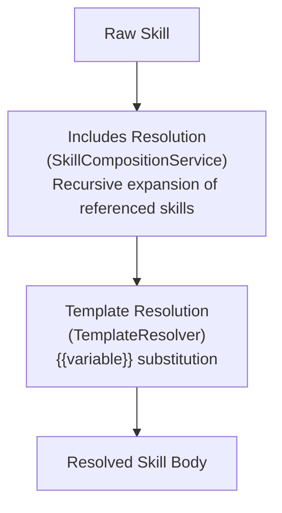

# Skill Composition

This deep dive covers how skills are assembled from their parts — includes resolution, template variable substitution, and the composition pipeline that produces final resolved content.

## Composition Pipeline



## Includes System

### How It Works

Skills reference other skills by slug in their frontmatter:

```yaml
---
name: Full Code Review
includes: [coding-standards, security-checklist, test-coverage-rules]
---

Review this code using all the standards above.
```

When resolved, the bodies of included skills are prepended in order:

```
[body of coding-standards]
[body of security-checklist]
[body of test-coverage-rules]
[body of Full Code Review]
```

### Recursive Resolution

Included skills can themselves include other skills:

```
full-code-review
├── includes: [coding-standards, security-checklist]
│
├── coding-standards
│   └── includes: [naming-conventions, formatting-rules]
│       ├── naming-conventions (no includes)
│       └── formatting-rules (no includes)
│
└── security-checklist
    └── includes: [owasp-top-10]
        └── owasp-top-10 (no includes)
```

Resolution order (depth-first):
1. naming-conventions
2. formatting-rules
3. coding-standards
4. owasp-top-10
5. security-checklist
6. full-code-review

### Circular Dependency Detection

The resolver tracks the visited path and detects cycles:

```
Scenario:
  skill-a includes skill-b
  skill-b includes skill-c
  skill-c includes skill-a  ← CIRCULAR

Detection:
  resolve(skill-a, visited=[])
    resolve(skill-b, visited=[skill-a])
      resolve(skill-c, visited=[skill-a, skill-b])
        resolve(skill-a, visited=[skill-a, skill-b, skill-c])
          → skill-a is in visited → throw CircularDependencyError
```

The error message includes the full chain: `skill-a → skill-b → skill-c → skill-a`.

### Max Depth

Includes are resolved up to a maximum depth of 5 levels. This prevents:
- Extremely deep chains that produce enormous resolved bodies
- Performance issues from deeply nested resolution
- Accidental complexity

If depth 5 is exceeded, the resolver logs a warning and stops expanding at that level.

### Missing Includes

If an included skill slug is not found in the project:

```
includes: [coding-standards, nonexistent-skill]
```

The resolver:
1. Logs a warning: "Included skill 'nonexistent-skill' not found"
2. Skips the missing skill
3. Continues with the rest

This is a warning, not an error — it doesn't block sync or composition.

## Template Variables

### Declaration

Template variables are declared in frontmatter:

```yaml
template_variables:
  - name: language
    description: Output language for the review
    default: English
  - name: framework
    description: The backend framework in use
    default: Laravel
  - name: min_coverage
    description: Minimum test coverage percentage
    default: "80"
```

### Usage

Variables appear as `{{name}}` placeholders in the body:

```markdown
Write your review in {{language}}.
This project uses {{framework}}.
Ensure minimum {{min_coverage}}% test coverage.
```

### Resolution Order

When a template variable is resolved, values are looked up in this order:

```
1. Project-level override (skill_variables table)
   → Most specific — set per project via the Variables UI
2. Skill-level default (from template_variables frontmatter)
   → Fallback — defined by the skill author
3. No value found
   → Leave {{variable}} as-is + emit lint warning
```

### Per-Project Overrides

Each project can override variable values for any skill:

```
skill_variables table:
├── project_id: 5
├── skill_id: 12
├── variable_name: "framework"
├── value: "Express.js"
```

This means the same skill can be used across projects with different values:
- Backend API project: `{{framework}}` → "Laravel"
- Node.js project: `{{framework}}` → "Express.js"
- Python project: `{{framework}}` → "FastAPI"

### Resolution Timing

Template variables are resolved at **compose time** and **sync time**, not at edit time. In the skill editor, you see the raw `{{variable}}` placeholders. They're filled in when:

- Composing an agent (agent compose preview)
- Syncing to providers (provider sync)
- Running a test (test runner)
- Executing an agent (execution engine)

## Agent Composition

Agent composition merges three layers:

```
1. Base Instructions (from agent definition)
   "You are a security auditor. Your role is to..."

2. Custom Instructions (per-project)
   "## Project-Specific Rules\n- Use SAST tool for scanning..."

3. Assigned Skill Bodies (resolved)
   [resolved body of security-checklist]
   [resolved body of owasp-top-10]
   [resolved body of coding-standards]
```

### Structured Compose (v2)

The structured compose returns a rich object:

```json
{
  "system_prompt": "...",
  "model": "claude-sonnet-4-6",
  "tools": [
    { "source": "mcp", "server": "filesystem", "tools": [...] },
    { "source": "a2a", "agent": "code-reviewer", "capabilities": [...] }
  ],
  "skills": [
    { "slug": "security-checklist", "tokens": 450 },
    { "slug": "owasp-top-10", "tokens": 800 }
  ],
  "loop_config": {
    "max_iterations": 20,
    "timeout": 300,
    "planning_mode": "structured"
  },
  "delegation_config": {
    "can_delegate": true,
    "targets": ["code-reviewer", "infrastructure-agent"]
  },
  "token_estimate": 3200
}
```

This structured output is used by:
- The execution engine (for running agents)
- Provider sync drivers (for generating config files)
- Export formats (for Claude Agent SDK, LangGraph, CrewAI)

## Token Estimation

Token estimates use a character-based approximation:

```
Tokens ≈ characters / 4
```

This is a rough estimate. Actual token counts vary by model and tokenizer. The estimate is used for:

- Skill editor budget indicator (green/yellow/red)
- Agent compose total token count
- Provider sync size warnings
- Pre-execution budget checks
