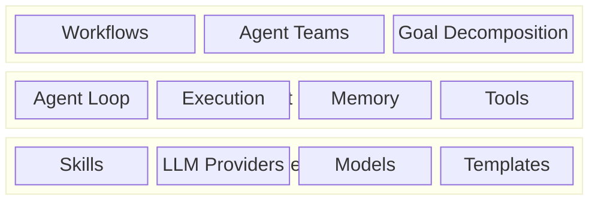
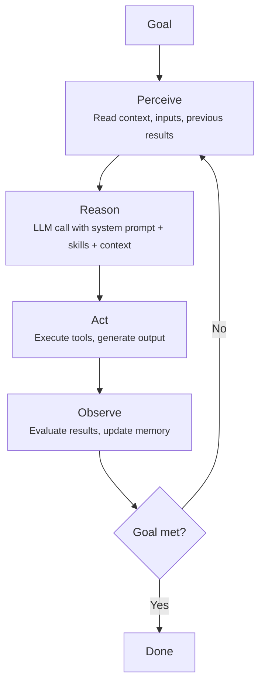
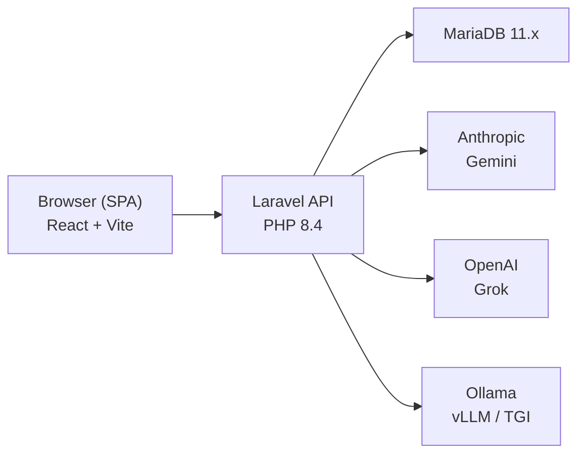

# Architecture

Orkestr is built as a three-layer architecture around an irreducible kernel. Each layer builds on the one below, moving from individual building blocks to fully orchestrated agent teams.

::: tip Design Philosophy
For the full architectural thesis — the irreducible kernel, the five design principles, and the sovereignty argument — see the [Design Philosophy](/deep-dive/design-philosophy) deep dive.
:::

## The Kernel

Before the layers, there's the kernel — six components without which nothing else functions:

1. **Declarative Agent Graph** — Agent definitions as YAML + Markdown data, not code. Portable, diffable, composable.
2. **Execution Engine** — The Perceive → Reason → Act → Observe loop that runs agents to completion.
3. **Capability Binding** — Skills (prompt modules), Tools (MCP), Agents (A2A). Three capability types, one contract each.
4. **Model Abstraction** — `LLMProviderInterface` with four methods. Seven provider implementations. No vendor lock-in.
5. **State Contract** — Agent memory, execution traces, version snapshots. The system remembers what happened.
6. **Control Hooks** — Budget guards, tool guards, approval gates. The system can halt any agent at any point.

Everything else — the three layers, the UI, the library, the analytics — is built on this kernel.

## Three-Layer Architecture

### Component Layer

The foundation. Individual skills (prompt + config), model connections, and template resolution.

- **Skills** -- YAML frontmatter + Markdown body, stored in `.agentis/skills/`
- **LLM Providers** -- Multi-model access via `LLMProviderFactory`, routing by model prefix to Anthropic, OpenAI, Gemini, Grok, or Ollama
- **Templates** -- `{{variable}}` substitution resolved at compose time
- **Includes** -- recursive skill composition with circular dependency detection (max depth 5)

### Agent Layer

Individual agents that can perceive, reason, and act. Each agent has a role, assigned skills, and execution capabilities.

- **Agent Configuration** -- 9+ pre-built agent roles (code reviewer, architect, etc.) with per-project customization
- **Agent Compose** -- merges base instructions + custom instructions + assigned skills into a single deployable prompt
- **Execution Loop** -- goal-driven agent execution with tool use and observation
- **Memory** -- per-agent context that persists across turns

### Orchestration Layer

Multi-agent coordination. Workflows chain agents together, decompose goals, and manage execution across teams.

- **Workflow Builder** -- visual editor for multi-step agent pipelines
- **Goal Decomposition** -- breaks complex objectives into sub-tasks assigned to appropriate agents
- **Team Coordination** -- manages handoffs, shared context, and conflict resolution between agents
- **Execution Monitoring** -- real-time SSE streaming of workflow progress

## The Agent Loop

Every agent execution follows the same cycle:

The loop continues until the goal is satisfied, a maximum iteration count is reached, or the agent determines it cannot make further progress.

## Key Services

### LLMProviderFactory

Routes model requests to the correct provider based on model name prefix:

| Prefix | Provider |
|---|---|
| `claude-` | Anthropic (via `mozex/anthropic-laravel`) |
| `gpt-`, `o` | OpenAI |
| `gemini-` | Google Gemini |
| `grok-` | xAI Grok |
| (other) | Ollama / custom endpoints |

### AgentExecutionService

Manages the agent loop -- receives a goal, runs the perceive-reason-act-observe cycle, manages tool calls, and returns results. Streams progress via SSE.

### WorkflowRunner

Executes multi-agent workflows. Takes a workflow definition (nodes + edges), resolves execution order, runs agents in sequence or parallel, manages data flow between steps, and handles errors/retries.

## Self-Hosted Deployment Model

Orkestr runs entirely on your infrastructure:

- The React SPA communicates with the Laravel API via session-based authentication
- The API layer handles all LLM provider communication, skill management, and agent orchestration
- MariaDB stores projects, skills, agents, organizations, and configuration
- LLM providers can be cloud APIs, local Ollama, or custom endpoints on your network
- No data leaves your infrastructure unless you explicitly configure cloud provider API keys

## Deployment Elasticity

The same Orkestr instance runs across four deployment tiers without architectural changes:

| Tier | Setup | Model Routing |
|---|---|---|
| Cloud-only | No GPU. Cloud API keys. | All agents use Anthropic, OpenAI, Gemini, etc. |
| Hybrid light | CPU / Apple Silicon + cloud | Some agents local (Ollama), others cloud. Mixed fallback chains. |
| Hybrid heavy | Dedicated GPU(s) + cloud | Most agents local (30–70B models). Cloud for peaks. |
| Air-gapped | No internet | All models via Ollama/vLLM. Air-gap mode enabled. |

Model routing is prefix-based at the factory level. The execution engine, workflow runner, and memory system don't know or care where models live. Switching tiers is a configuration change, not an architecture change.

See [Design Philosophy](/deep-dive/design-philosophy) for the full rationale.
